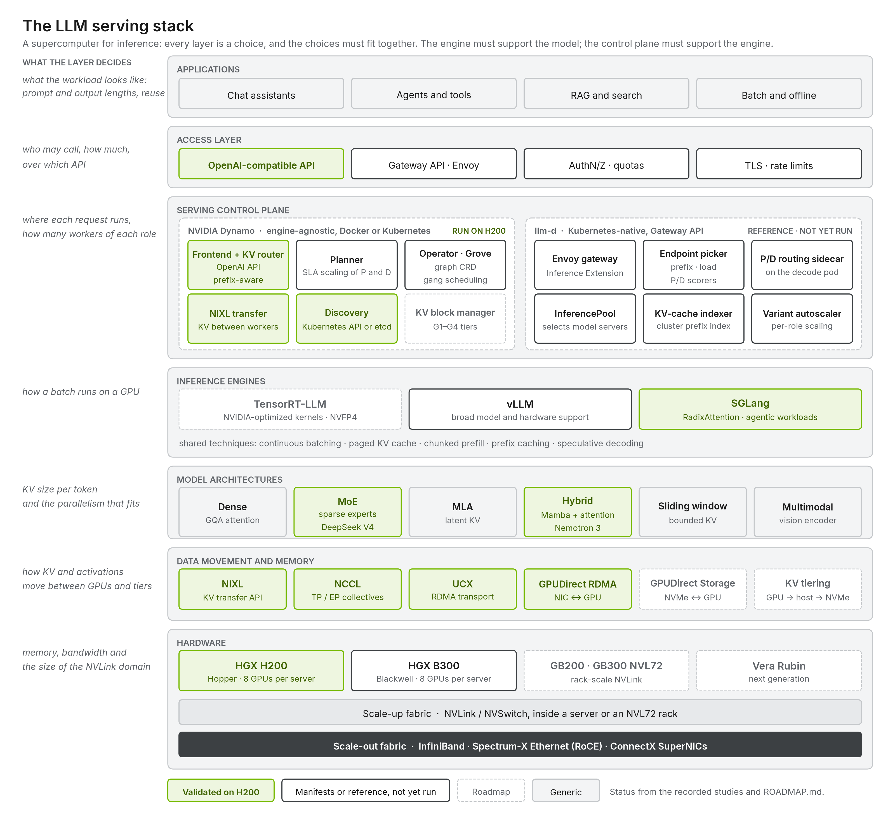

# Serving Solutions: an LLM inference decision and deployment framework

A vendor-neutral way to decide, size, deploy and validate LLM inference for partners and
customers, with two implementation tracks measured on real clusters:

1. **[Framework](framework/README.md)**: the process. Intake → decide → size → deploy and validate →
   operate, with templates and decision matrices across model architecture and size, hardware,
   solution stack, workload (chat, RAG, agents, coding, reasoning, batch) and optimization goal
   (long context, output-optimized, SLA, throughput and cost).
2. **[Blueprint](blueprint/README.md)**: the knowledge the decisions cite, chapters 01–15, product-agnostic.
3. **[Tracks](tracks/README.md)**: the implementations.
   - **Track 1 · [NVIDIA Dynamo](tracks/nvidia-dynamo/README.md)**: operator, graphs, production overlay, measured lab sites, studies.
   - **Track 2 · [llm-d + Red Hat AI](tracks/llm-d-redhat/README.md)**: the eight llm-d well-lit paths with the Red Hat AI Inference Server, each with a guide, manifests and a test.
4. **[Platform](platform/README.md)**: the cluster layer both tracks share.

Every measured number comes from a recorded study with pinned images, request hashes and
cache-reset evidence. Everything not yet run is marked **UNVALIDATED**.

## Start here

| You want to… | Go to |
| --- | --- |
| Recommend a deployment for a customer workload | [framework/](framework/README.md): fill a [deployment profile](framework/1-intake/profile.template.yaml), then follow [2 · Decide](framework/2-decide/README.md) |
| Understand why a pattern wins or loses | [blueprint/](blueprint/README.md), especially [11 · Decision guide](blueprint/11-decision-guide.md) and [15 · Workload-driven design](blueprint/15-workload-driven-design.md) |
| Deploy with NVIDIA Dynamo | [tracks/nvidia-dynamo/](tracks/nvidia-dynamo/README.md) |
| Deploy with llm-d and Red Hat AI | [tracks/llm-d-redhat/](tracks/llm-d-redhat/README.md), starting from [path 01](tracks/llm-d-redhat/paths/01-optimized-baseline/README.md) |
| See the evidence | [Evidence register](framework/4-validate/README.md#evidence-register) |
| Run a benchmark | [benchmarks/](benchmarks/README.md) |

## Status by track

| Track | Measured | Deployed, being measured | Reference (offline-tested) | Planned |
| --- | --- | --- | --- | --- |
| NVIDIA Dynamo | Aggregated and P/D with SGLang on 2 × H200: three studies | — | Operator graphs and production overlay; B300 vLLM/SGLang tracks | 10 prepared studies |
| llm-d + Red Hat AI | — | Path 01 with DeepSeek V4 Pro on 4 × H200 (256K routing study) | Path 05 on B300 | Paths 02–04, 06–08 |

## Measured results

Three matched Dynamo studies on the same 16 H200 GPUs compared aggregated replicas with
disaggregated prefill/decode ([analysis](blueprint/12-results-and-reconciliation.md)):

| Study | Layouts | Aggregated | Disaggregated |
| --- | --- | --- | --- |
| [DeepSeek V4 Pro, 256K input](tracks/nvidia-dynamo/studies/deepseek-v4-pro-256k-comparison/REPORT.md), concurrency 4 | 2 × TP8 vs 1P + 1D TP8 | 141.45 s | 782.50 s |
| [Nemotron 3 Nano, 128K in / 256 out](tracks/nvidia-dynamo/studies/nemotron-3-nano-128k-comparison/REPORT.md), 3 runs | 2 × TP8 vs 1P + 1D TP8 | 65.09 s mean, TPOT 4.35 ms | 105.48 s mean, TPOT 4.64 ms |
| [Nemotron 3 Nano, 8K in / 128K out](tracks/nvidia-dynamo/studies/nemotron-3-nano-8k-128k-comparison/REPORT.md), at the KV limit, 3 runs | 4 × TP4 vs 1P + 3D TP4 | 34,677 output tok/s, worst ITL 40.4 s | 25,852 output tok/s, worst ITL 1.1 s |

**What they say.** On two nodes with fixed TP8 or TP4 workers and a fixed P:D ratio,
aggregated serving was faster in every study (5.5×, 1.62×, 1.34×). Disaggregated serving
removed prefill-induced decode stalls: its worst inter-token gap was 1.1 s against 40.4 s.
The studies used prefill-only and decode-only extremes, so they do not show where
disaggregation wins; that is [planned study 01](tracks/nvidia-dynamo/studies/planned/01-pd-ratio-sweep/README.md).

## Repository map

| Path | Contents |
| --- | --- |
| [framework/](framework/README.md) | Decision and delivery process: stages, templates, decision matrices, evidence register |
| [blueprint/](blueprint/README.md) | Architecture chapters 01–15 |
| [tracks/nvidia-dynamo/](tracks/nvidia-dynamo/README.md) | `install/`, `common/`, `graphs/`, `production/`, `observability/`, `sites/` (H200 lab, B300 reference + Compose), `studies/` (completed + `planned/`) |
| [tracks/llm-d-redhat/](tracks/llm-d-redhat/README.md) | `install/`, `paths/01–08` (guide + per-site instances), `studies/` |
| [platform/](platform/README.md) | Prerequisites, GPU/Network Operator values, site descriptions and storage, `site.env.example` |
| [benchmarks/](benchmarks/README.md) | Load generators, metrics, sweeps, methodology, the generic compare notebook |
| [datasets/](datasets/README.md), [configs/](configs/README.md) | Seed workloads; model and cluster catalogs for the generators |
| [reference/](reference/README.md) | Glossary, engine flags, troubleshooting, pinned sources, vendored upstream schemas |
| [tools/](tools/README.md) | Generators (graphs, overlays, studies, diagrams), site rendering, validation, preflight, archives |
| [tests/](tests/README.md) | Offline tests: `python -m pytest -q` and `python tools/validate.py` |

## Pinned versions

| Component | Version |
| --- | --- |
| NVIDIA Dynamo (operator, frontend, Planner) | 1.4.0 (`v1.4.0`, commit `0301494`); images pinned by digest |
| SGLang in the Dynamo runtime | 0.5.16 |
| vLLM in the Dynamo runtime | 0.26.0 (B300 reference tracks) |
| Grove / KAI scheduler (pinned by dynamo-platform 1.4.0) | v0.1.0-alpha.12-rc1 / v0.13.4 |
| llm-d / llm-d router (EPP) / Gateway API Inference Extension | v0.10.0 / v0.11.0 / v1.5.0 |
| Red Hat AI Inference Server (vLLM) | `rhaii-fast/vllm-cuda-rhel9:3.6.0-fast.1` (vLLM 0.26.0) |
| NVIDIA GPU Operator / Network Operator | v26.7.1 / v26.7.0 |
| Gateway API / Envoy Gateway / cert-manager | v1.3.0 / v1.4.2 / v1.17.2 |

Sources and verification: [reference/sources.md](reference/sources.md),
[reference/upstream-verification.md](reference/upstream-verification.md). Roadmap:
[ROADMAP.md](ROADMAP.md). Changes and open verification items: [REVIEW-CHANGELOG.md](REVIEW-CHANGELOG.md).
Contributing: [CONTRIBUTING.md](CONTRIBUTING.md).
