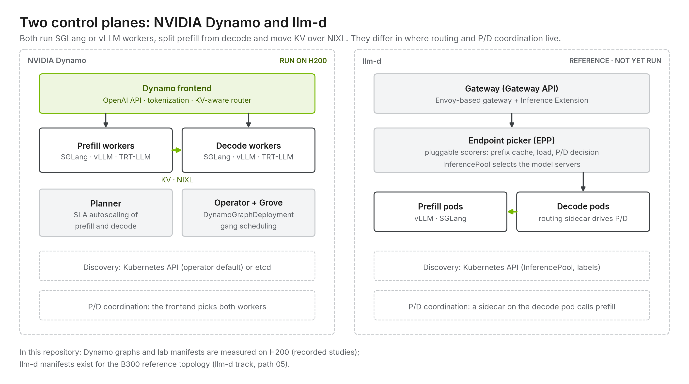
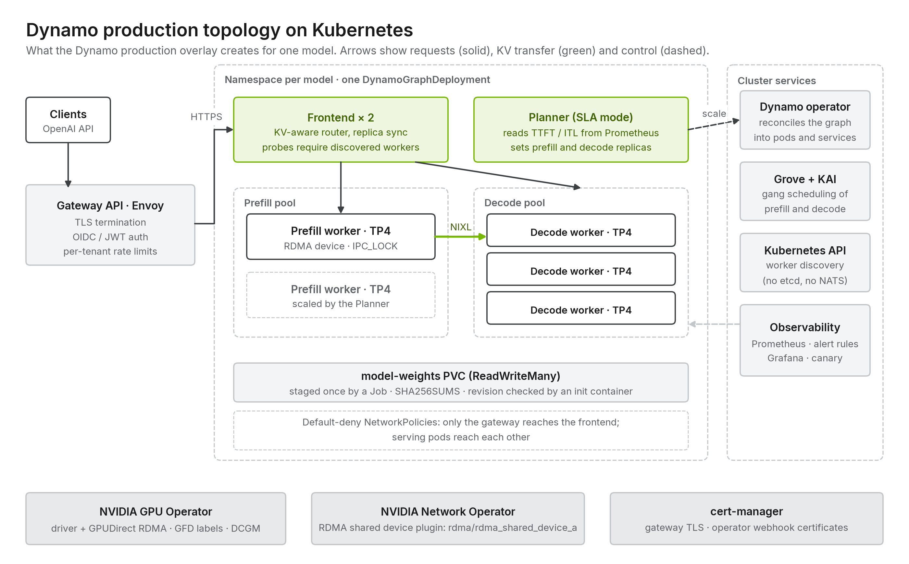

# 04 · Orchestration layer: Dynamo and llm-d

[Home](../README.md) › [Blueprint](README.md) › 04 · Orchestration layer

**Executive summary.** The control plane routes requests, places workers and scales pools. Dynamo provides the frontend with a KV-aware router, the Planner (SLA autoscaling) and a Kubernetes operator; llm-d builds on the Gateway API Inference Extension. The production path here is the Dynamo 1.4.0 operator with Kubernetes-API discovery and Grove/KAI gang scheduling (UNVALIDATED on hardware).

| What you get from this repository | What you still own |
| --- | --- |
| Operator install values ([tracks/nvidia-dynamo/install](../tracks/nvidia-dynamo/install/)), DynamoGraphDeployments, Planner and router configuration | Operator upgrades and control-plane standards for your clusters |

The serving control plane sits between the API and the engines and decides **where every request runs**: which worker, which phase, and how many workers of each kind exist.

## What a serving control plane must do

| Responsibility | Why it matters for LLMs |
|---|---|
| **API front door** | OpenAI-compatible endpoint, tokenization and chat templates, streaming |
| **KV-aware routing** | Send requests to the worker that already holds their prefix. Balance cache hits against load. |
| **Discovery** | Track workers as they start, fail and scale |
| **P/D coordination** | Run prefill, hand KV metadata to decode, handle failures |
| **Autoscaling** | Scale prefill and decode pools separately against TTFT and ITL SLOs |
| **KV-cache management** | Index KV across workers and tiers (GPU, DRAM, NVMe, shared storage) |
| **Lifecycle** | Deploy, upgrade and gang-schedule multi-GPU, multi-role workers |

## The two leading open implementations

Both use the same engines and the same NIXL KV transfer underneath. They differ in **where decisions live** and **what platform they assume**.

### NVIDIA Dynamo

An engine-agnostic inference runtime that runs on bare Docker hosts or Kubernetes.

| Component | Role |
|---|---|
| **Frontend** | OpenAI-compatible HTTP server with tokenizer and chat templates |
| **KV router** | Keeps a global index (radix tree) of which worker holds which KV blocks, built from engine **KV events**. Routes by overlap and load. |
| **Workers** | `dynamo.vllm`, `dynamo.sglang`, `dynamo.trtllm`: thin wrappers that register with discovery and speak Dynamo's request plane |
| **Discovery / planes** | Kubernetes API for discovery (operator default in 1.4.0; etcd optional); request plane over TCP (or NATS); event plane over ZMQ (or NATS) |
| **NIXL** | NVIDIA Inference Xfer Library: the KV transfer API between workers and storage tiers (UCX, GDS and other backends) |
| **Planner** | SLO-driven autoscaler that adjusts prefill and decode worker counts |
| **KV Block Manager (KVBM)** | Tiered KV cache across GPU, host memory, disk and remote storage |
| **Kubernetes operator + Grove** | `DynamoGraphDeployment` CRD for lifecycle; Grove for gang scheduling of multi-node, multi-role workloads |

**P/D coordination lives in the frontend and router.** The frontend dispatches prefill, then decode with the KV handles.

### llm-d

A Kubernetes-native distributed inference stack built on the Kubernetes **Gateway API Inference Extension**.

| Component | Role |
|---|---|
| **Gateway** | Envoy-based proxy (standalone chart, or any Gateway API implementation) |
| **Endpoint picker (EPP)** | Called by the gateway for every request. Pluggable filters and scorers: prefix-cache affinity, queue depth, active requests, a P/D decider. |
| **InferencePool** | Kubernetes CRD that groups model-server pods. Discovery is the Kubernetes API itself. |
| **Routing sidecar** | Runs next to the decode engine. Calls prefill first, then decode, with KV transfer parameters. |
| **Engines** | Stock `vllm serve` (primary) and `sglang` servers |
| **KV-cache indexer / LMCache** | Cache-aware routing and tiered prefix caching |
| **Variant autoscaler** | Scales model-server variants (for example, per role) against demand |
| **"Well-lit paths"** | Tested guides: intelligent inference scheduling, P/D disaggregation, wide expert parallelism, tiered prefix caching |

**P/D coordination lives in the decode-side sidecar.** The gateway routes to a decode pod, and its sidecar drives prefill.

## Side-by-side

| | NVIDIA Dynamo | llm-d |
|---|---|---|
| Platform | Docker hosts or Kubernetes | Kubernetes only (Gateway API, CRDs) |
| Front door | Dynamo frontend (Python/Rust) | Envoy gateway + EPP |
| Discovery | Kubernetes API (etcd optional) | Kubernetes API (InferencePool, labels) |
| KV-aware routing | Global KV index from engine events | EPP prefix scorers + KV-cache indexer |
| P/D coordination | Frontend / router | Decode-side routing sidecar |
| Engines | TensorRT-LLM, vLLM, SGLang | vLLM (primary), SGLang |
| Autoscaling | Planner (SLO-driven, P/D-aware) | Variant autoscaler, HPA/KEDA |
| KV tiering | KVBM (GPU → DRAM → disk → remote) | LMCache-based tiered prefix cache |
| Deployment unit | `DynamoGraphDeployment` or plain processes | Helm charts / Kustomize "well-lit paths" |
| Strength | Full-stack NVIDIA optimization, works off Kubernetes, all three engines | Composes with standard Kubernetes networking and gateways |

## The broader landscape

Other projects cover parts of this layer and often compose with the two above:

| Project | Role |
|---|---|
| **KServe** (`LLMInferenceService`) | Kubernetes model-serving API. Recent releases can use llm-d underneath. |
| **Gateway API Inference Extension** | The Kubernetes standard llm-d builds on, usable with several gateway implementations |
| **vLLM production-stack**, **SGLang router / model gateway** | Engine-project routers with cache-aware load balancing |
| **AIBrix** | Kubernetes control plane for vLLM with routing, autoscaling and KV offloading components |
| **NVIDIA NIM** | Packaged, optimized model containers that can run under these control planes |
| **Ray Serve LLM** | Python-native serving on Ray clusters, with P/D support |

## Choosing

| If you… | Lean toward |
|---|---|
| Run on bare-metal Docker hosts, or need to start before Kubernetes is ready | **Dynamo** |
| Want TensorRT-LLM, or one control plane across all three engines | **Dynamo** |
| Want SLO-driven P/D autoscaling and multi-tier KV from one vendor stack | **Dynamo** (Planner + KVBM) |
| Are a Kubernetes-first platform team standardizing on Gateway API | **llm-d** |
| Want routing decisions pluggable as Kubernetes-native components | **llm-d** (EPP plugins) |
| Need to compare both on your hardware | Deploy [02](../tracks/nvidia-dynamo/sites/hgx-b300-2x8/02-dynamo-disagg-vllm/) and [04](../tracks/llm-d-redhat/paths/05-pd-disaggregation/hgx-b300-qwen3-coder-480b/) with the same model and use [benchmarks/](../benchmarks/) |

Either way, keep the access layer OpenAI-compatible so the control plane stays replaceable ([principle 12](02-design-principles.md#12-keep-the-control-plane-boring)).

---

**Next:** [05 · Inference engines](05-inference-engines.md)
