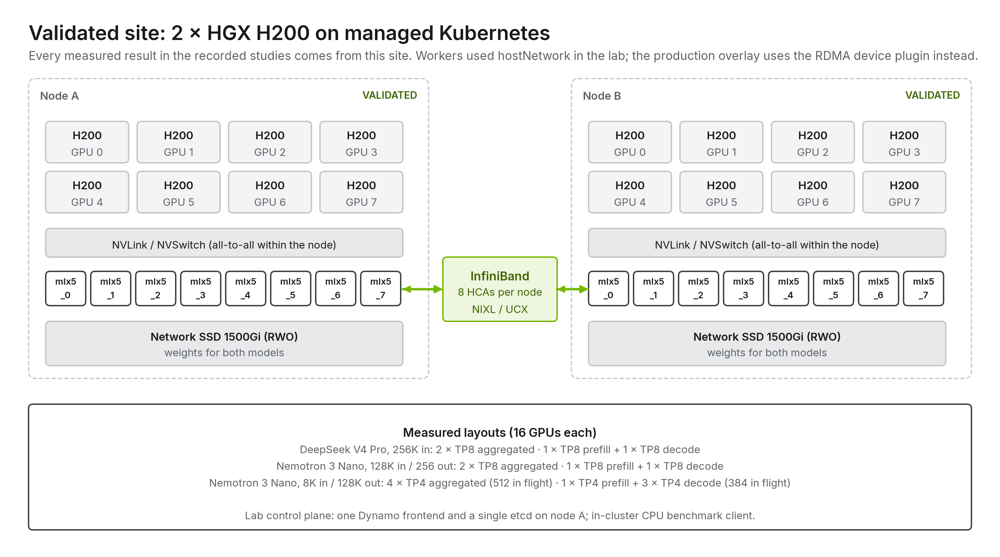
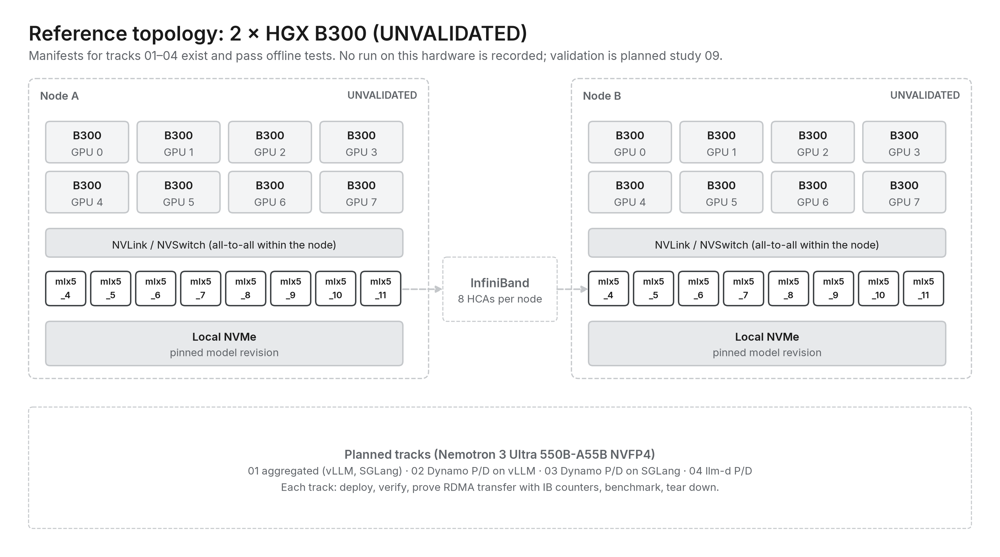

# 07 · Hardware, network and storage

[Home](../README.md) › [Blueprint](README.md) › 07 · Hardware, network and storage

**Executive summary.** HBM per GPU, the size of the NVLink domain and how fast KV can leave the GPU decide most designs. The validated site is 2 × HGX H200 with eight InfiniBand HCAs per node; the 2 × HGX B300 design is a reference topology that has not been run. RDMA is provided by the Network Operator's device plugin in production, not by privileged pods.

| What you get from this repository | What you still own |
| --- | --- |
| GPU and Network Operator configuration, RDMA proof method, site topologies | Fabric design, firmware and capacity |

Hardware sets the limits of every layer above it. Three questions decide most designs: **how much HBM** each GPU has, **how large the NVLink domain** is, and **how fast KV can leave the GPU**, whether to another GPU or to storage.

## GPU generations

| System | GPU memory | NVLink per GPU | NVLink domain | Notes |
|---|---|---|---|---|
| HGX H100 | 80 GB HBM3 | 900 GB/s (NVLink 4) | 8 GPUs | FP8 |
| HGX H200 | 141 GB HBM3e | 900 GB/s | 8 GPUs | More KV per GPU than H100 |
| HGX B200 | ~180 GB HBM3e | 1.8 TB/s (NVLink 5) | 8 GPUs | FP4 / NVFP4 |
| HGX B300 (Blackwell Ultra) | 288 GB HBM3e | 1.8 TB/s | 8 GPUs | Reference hardware in this repository |
| GB200 NVL72 | ~186 GB per GPU | 1.8 TB/s | **72 GPUs** | Grace CPUs, rack-scale NVLink |
| GB300 NVL72 | 288 GB per GPU | 1.8 TB/s | **72 GPUs** | Blackwell Ultra, rack scale |
| Vera Rubin (NVL rack) | 288 GB HBM4 per GPU (announced) | 3.6 TB/s (NVLink 6, announced) | rack scale | Next generation |
| Rubin CPX (announced) | GDDR7 | n/a | paired with Rubin racks | Context/prefill-optimized accelerator: hardware-level P/D |

Figures are nominal vendor values, and announced parts may change. Check current NVIDIA datasheets before sizing.

## Scale-up and scale-out

- **Scale-up fabric (NVLink / NVSwitch):** all-to-all GPU bandwidth inside a server (8 GPUs) or a rack (72 GPUs on NVL72). This is where tensor parallelism and wide expert parallelism belong.
- **Scale-out fabric (InfiniBand or RoCE Ethernet):** connects servers and racks, usually with **one NIC per GPU** at 400–800 Gb/s (ConnectX-7 / ConnectX-8 SuperNICs, Quantum-X800 InfiniBand, Spectrum-X Ethernet). This is where P/D transfers between servers, pipeline parallelism and data-parallel replicas go.

| Placement | 8-GPU servers | Rack-scale NVL72 |
|---|---|---|
| Tensor parallelism | ≤ 8, inside the server | ≤ 8 typically; larger possible |
| Expert parallelism | ≤ 8 on NVLink; beyond that over the fabric | Wide EP across up to 72 GPUs on NVLink |
| P/D KV transfer | Between servers over GPUDirect RDMA | Inside the rack over NVLink; RDMA between racks |
| Grows by | Adding servers | Adding racks |

## The KV data path: GPUDirect RDMA over rails

- **Sharded KV.** With TP8, GPU *i* holds shard *i* of every layer's KV cache.
- **Rail-optimized.** GPU *i* shares a PCIe switch with NIC *i*, and NIC *i* on every server connects to the same leaf ("rail"). Shard *i* crosses on rail *i*, so all eight rails work in parallel.
- **GPUDirect RDMA.** The NIC reads and writes GPU memory directly. It needs `nvidia-peermem` or DMA-BUF, registered memory (`IPC_LOCK`, unlimited memlock), and RDMA devices in the container.
- **Software.** NIXL (transfer API) → UCX (transport: `rc_x`/`rc` verbs plus CUDA memory types) → verbs. Pin UCX to the RDMA NICs (`UCX_NET_DEVICES`), never to Ethernet.
- **Control vs data.** Ethernet carries only control traffic: HTTP, discovery, request plane, NIXL metadata. A working `curl` says nothing about RDMA. Test the fabric directly with `ib_write_bw`, ideally from GPU memory.

## Storage

| Tier | Typical technology | Used for |
|---|---|---|
| Local NVMe | PCIe Gen5 drives, one or more per GPU pair | Model weights, compile caches, **KV tier G3** |
| Shared parallel file system | GDS-capable parallel file systems over RDMA | Model repository, **KV tier G4** shared across nodes |
| Object storage | S3-compatible | Model registry, cold artifacts |

**GPUDirect Storage (GDS)** lets NVMe write directly into GPU memory through the PCIe switch, with no CPU bounce buffer. It is the storage counterpart of GPUDirect RDMA, and it makes NVMe a practical KV tier ([chapter 08](08-kv-cache-and-offloading.md)). Topology matters here too: place drives under the same PCIe switches as the GPUs that read them.

## Reference hardware in this repository

Two HGX B300 servers (8 × B300, 288 GB each) with eight 800 Gb/s InfiniBand rails per node (`mlx5_4` … `mlx5_11`), a private Ethernet control network, and local NVMe for weights. [platform/prerequisites](../platform/prerequisites/) shows how to verify each part.

## Hardware checklist

- [ ] `nvidia-smi topo -m` shows each GPU with a nearby NIC (PIX/PXB), and NVMe drives placed near GPUs if GDS is planned.
- [ ] `ib_write_bw` reaches near line rate on every rail, from GPU memory where perftest supports it.
- [ ] GPUDirect RDMA is enabled (`nvidia_peermem` or DMA-BUF), and memlock is unlimited.
- [ ] The NVLink domain size matches the planned TP/EP.
- [ ] Storage bandwidth per node is enough for weight loading and any KV tier.

---

**Next:** [08 · KV cache and offloading](08-kv-cache-and-offloading.md)
