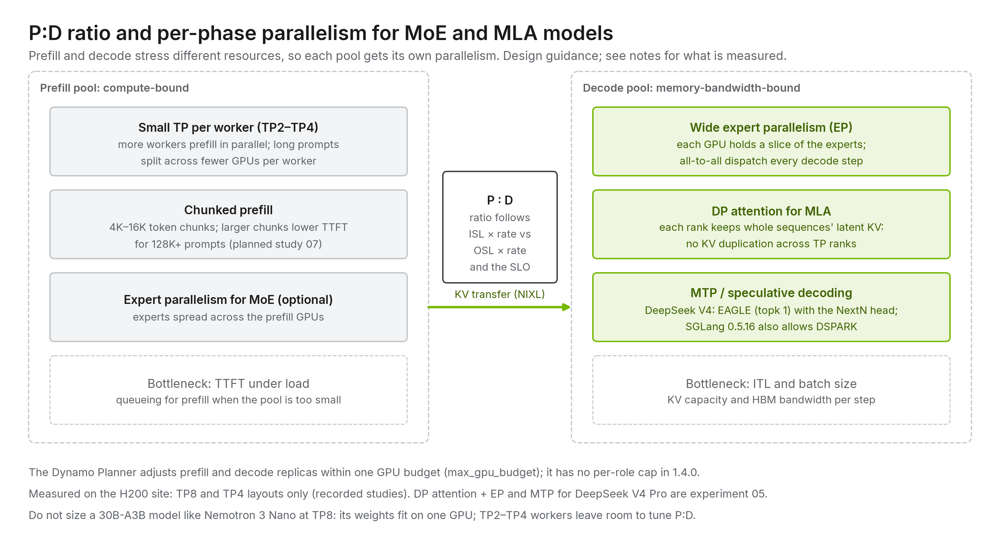

# 09 · Parallelism and sizing

[Home](../README.md) › [Blueprint](README.md) › 09 · Parallelism and sizing

**Executive summary.** Keep TP and EP inside the NVLink domain, size TP from weights and KV rather than from the GPU count, and give prefill and decode their own parallelism. Size pools from measured per-worker throughput at your SLOs; the Planner adjusts them within one GPU budget.

| What you get from this repository | What you still own |
| --- | --- |
| A sizing method, measured H200 per-worker capacities, and a prepared P:D sweep | A capacity plan from your own traffic |

## Parallelism: what it splits and where it belongs

| Strategy | Splits | Communication | Place it on | Typical use |
|---|---|---|---|---|
| **Tensor (TP)** | Every layer's matrices across GPUs | All-reduce **every layer** | NVLink domain (≤ 8 on HGX) | Fit a large model, lower per-token latency |
| **Expert (EP)** | MoE experts across GPUs | All-to-all per MoE layer | NVLink; **wide EP** on NVL72 | Large MoE, especially decode |
| **Data-parallel attention (DP attention)** | Attention by sequence, with experts shared via EP | Gather/scatter around MoE layers | NVLink | MLA models (DeepSeek-class) |
| **Pipeline (PP)** | Layers into stages across GPUs or nodes | Point-to-point activations between stages | Scale-out fabric acceptable | Models too large for one NVLink domain |
| **Context / sequence (CP)** | One very long prompt across GPUs | Ring or all-gather of KV | NVLink | Very long-context prefill |
| **Replicas (DP)** | Independent copies of the model | None between replicas | Anywhere | Throughput scaling |
| **P/D disaggregation** | Phases across pools | KV transfer per request | GPUDirect RDMA or NVLink | Latency SLOs, long inputs |

**Rule:** the more often a strategy communicates, the closer to NVLink it must live. TP and EP run every layer; PP and P/D run once per stage or per request ([principle 4](02-design-principles.md#4-keep-tight-collectives-inside-the-scale-up-domain)).

Prefill and decode can use **different** parallelism: for example, small TP (plus EP) for prefill and wide EP with DP attention for decode on a large MoE. Supporting that is one of disaggregation's main benefits.



## Memory budget per GPU

```text
HBM usable            = HBM × memory_fraction                 (e.g. 0.80–0.90)
weights per GPU       = model_bytes / (TP × PP)               (EP divides the expert weights)
KV budget per GPU     = HBM usable − weights per GPU − activations/workspace
max resident tokens   = (KV budget per GPU × TP) / KV_bytes_per_token
concurrent sequences  ≈ max resident tokens / average (ISL + OSL)
```

*Reference example (illustrative).* Nemotron 3 Ultra NVFP4 is about 352 GB of weights. At TP8 that is about 44 GB per GPU. A B300 has 288 GB, and at 0.80 about 230 GB is usable. That leaves on the order of 150–180 GB per GPU for KV, Mamba state and workspace, which is why 32K contexts at 32 sequences are a conservative starting point.

*Measured example (H200).* Nemotron 3 Nano 30B-A3B in BF16 is about 60 GB of weights, so it
fits on one 141 GB H200. TP8 was used in the 128K study only to match the 16-GPU, two-worker
comparison; it is **not** a sizing recommendation. At TP4 the automatically sized KV pool held
19.6M tokens per worker, enough for 140 requests of 139K tokens
([8K/128K study](../tracks/nvidia-dynamo/studies/nemotron-3-nano-8k-128k-comparison/REPORT.md)). Size this
model with TP1–TP4 workers, chosen so the P:D ratio can follow the traffic
([tracks/nvidia-dynamo/studies/planned/01](../tracks/nvidia-dynamo/studies/planned/01-pd-ratio-sweep/)).

*Design example (MLA).* For DeepSeek-class MLA models, use DP attention with wide EP on
decode instead of TP, so each rank holds whole sequences' latent KV and experts are spread
across the GPUs. Add MTP as a decode-side lever ([chapter 06](06-model-architectures.md)), and decode context
parallelism (DCP) when latent KV capacity limits concurrency ([chapter 14](14-frontier-moe-techniques.md)).
Speculative decoding lowers TPOT and therefore *L*, so re-derive N_D with it enabled
([chapter 13](13-speculative-decoding.md)). How the resulting P:D ratio varies by workload is in
[chapter 15](15-workload-driven-design.md).

## Sizing the pools from SLOs

Size from traffic and SLOs, then verify with measurements ([principle 8](02-design-principles.md#8-size-from-slos-not-from-peak-flops)).

**Inputs.** Arrival rate λ (requests/s), average input ISL and output OSL (tokens), the p99 TTFT and p99 ITL targets, and prefix-reuse rate *r* (the fraction of input tokens served from cache).

**Measured per worker** (with this repository's benchmarks, at your SLOs):

- **Tp**: prefill tokens/s one prefill worker sustains while meeting TTFT.
- **Sd**: concurrent sequences one decode worker sustains while meeting ITL, limited by compute *and* by KV memory.

```text
Prefill workers   N_P = ⌈ λ × ISL × (1 − r) / Tp ⌉
Decode sequences  L   = λ × OSL × ITL                 (Little's law: sequences in flight)
Decode workers    N_D = ⌈ L / Sd ⌉
```

**Worked example (illustrative numbers).** λ = 2 req/s, ISL = 16,000, OSL = 500, r = 0, ITL target 30 ms.

| Quantity | Value |
|---|---|
| Prefill demand | 2 × 16,000 = 32,000 tokens/s |
| With Tp = 40,000 tokens/s per worker | N_P = 1 (0.8 utilized) |
| Sequences in decode | 2 × 500 × 0.03 s = 30 |
| With Sd = 64 per worker | N_D = 1 |
| **P:D** | **1:1**, which is the reference deployment's shape |

Now double the input length to 32,000 tokens. Prefill demand becomes 64,000 tokens/s, so N_P = 2 while N_D stays 1. The ratio becomes **2:1**. An aggregated design would have to add whole replicas to absorb the same change. This is the scaling argument for disaggregation in numbers.

Add headroom (N+1 per pool) for failures and bursts. Re-measure Tp and Sd whenever the model, engine, precision or context limit changes. Prefix reuse (*r*) reduces prefill demand directly, which is why KV-aware routing and [offloading](08-kv-cache-and-offloading.md) change the sizing.

## Sizing workflow

1. Characterize the traffic: λ over the day, ISL/OSL distributions, prefix reuse. Use redacted production traces if possible.
2. Choose the model precision and the context limit.
3. Pick parallelism per phase from the table above and the NVLink domain size ([chapter 07](07-hardware-network-storage.md)).
4. Deploy one prefill and one decode worker ([B300 track 02](../tracks/nvidia-dynamo/sites/hgx-b300-2x8/02-dynamo-disagg-vllm/)) and measure Tp and Sd with [benchmarks/](../benchmarks/) at the target SLOs.
5. Compute N_P and N_D, and add headroom.
6. In production, let an SLO-driven autoscaler (Dynamo Planner, llm-d variant autoscaler) track the ratio as traffic shifts.

---

**Next:** [10 · Production operations](10-production-operations.md)
