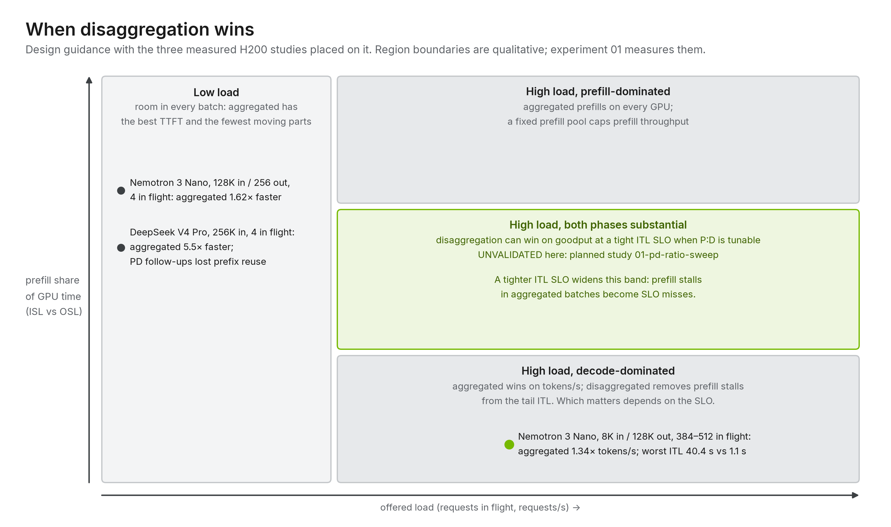

# 12 · Results and reconciliation

[Home](../README.md) › [Blueprint](README.md) › 12 · Results and reconciliation

**Executive summary.** Three matched studies on one 2 × HGX H200 site compared
aggregated and disaggregated serving with the same model, image and 16 GPUs.
Aggregated was faster in all three: 5.5×, 1.62× and 1.34×. Disaggregated serving never
let prefill stall decode: its worst inter-token gap was 1.1 s against 40.4 s. These
results do not contradict NVIDIA's published Dynamo results. They measure a different
region of the design space: two nodes, fixed TP8 or TP4 workers, a fixed P:D ratio and
synthetic extremes of input/output length. The decision depends on workload shape, SLO
tightness, whether the P:D ratio can be tuned, and the fabric. There is no universal
ranking.

| | What you get from this repository | What you still own |
| --- | --- | --- |
| Evidence | Three studies with pinned images, request hashes, cache-reset acknowledgements and repeats; raw evidence in release archives | Measurements on your own traffic, hardware and SLOs |
| Next measurements | [tracks/nvidia-dynamo/studies/planned/](../tracks/nvidia-dynamo/studies/planned/) prepared to close the gaps listed below | Running them and deciding from goodput at your SLO |

## The three studies

All three ran on the [validated H200 site](../tracks/nvidia-dynamo/sites/nebius-h200-2x8/), with
in-cluster load generation and worker caches flushed before every measured run.

| Study | Workload | Layouts (16 GPUs) | Runs | Result |
| --- | --- | --- | --- | --- |
| [DeepSeek V4 Pro 256K](../tracks/nvidia-dynamo/studies/deepseek-v4-pro-256k-comparison/) | 8 sessions × 3 turns, ~256K input, concurrency 4 | 2 × TP8 aggregated vs 1 × TP8 prefill + 1 × TP8 decode | 1 per layout | Aggregated 141.45 s vs disaggregated 782.50 s (5.5×). Aggregated follow-ups reused their prefixes; disaggregated follow-ups reprocessed them |
| [Nemotron 3 Nano 128K](../tracks/nvidia-dynamo/studies/nemotron-3-nano-128k-comparison/) | 32 sessions × 3 turns, 128K input, ≤ 256 output, concurrency 4 | 2 × TP8 aggregated vs 1 × TP8 prefill + 1 × TP8 decode | 3 per layout, 576 requests | Mean run 65.09 s vs 105.48 s (1.62×). Median TTFT 0.110 s vs 2.503 s; median TPOT 4.35 ms vs 4.64 ms |
| [Nemotron 3 Nano 8K/128K](../tracks/nvidia-dynamo/studies/nemotron-3-nano-8k-128k-comparison/) | 8K input, exactly 131,072 output tokens, one wave at the KV limit | 4 × TP4 aggregated (512 in flight) vs 1 × TP4 prefill + 3 × TP4 decode (384 in flight) | 3 per layout, 2,688 requests | 34,677 vs 25,852 output tokens/s (1.34×). TPOT 14.51 ms vs 14.15 ms; worst ITL 40.4 s vs 1.1 s; TTFT p50 11.0 s vs 36.5 s |

## Why disaggregation lost each one

**DeepSeek V4 Pro, 256K input.** The workload is almost all prefill: about 256K input
tokens against a few hundred output tokens. With 1P:1D, only one of the two TP8 workers
can prefill, while aggregated mode prefills on both. On top of that, the disaggregated
follow-up turns did not reuse their cached 256K-token prefixes: each turn recomputed its
session's long prefix instead of computing it once. The cause is undiagnosed. Decode-side
radix caching is off by default in SGLang PD mode
(`--disaggregation-decode-enable-radix-cache`), and the KV router places follow-ups by
prefill-side overlap. [Experiment 05](../tracks/nvidia-dynamo/studies/planned/05-deepseek-layout/) tests both.
This is a single run per layout.

**Nemotron 3 Nano, 128K input / 256 output.** The workload is again prefill-dominated,
and 1P:1D again halves prefill capacity. Here prefix reuse worked in both modes: 192/192
disaggregated follow-ups and 190/192 aggregated follow-ups reported cache hits. So the
1.62× gap is mostly prefill capacity plus the handoff: the disaggregated study moved
865.75 GiB over InfiniBand. First-turn median TTFT was 2.814 s aggregated and 6.734 s
disaggregated.

**Nemotron 3 Nano, 8K input / 128K output.** The opposite extreme: prefill is 8,000 of
139,072 tokens per request, so the prefill worker sat idle for most of each 32-minute run
while three decode workers did the work four aggregated workers shared. The 1.34×
throughput gap is close to the 4:3 ratio of decode-capable workers. Per-worker decode
speed was equal or slightly better disaggregated (TPOT 14.15 ms vs 14.51 ms).

The common thread: each study fixed the P:D ratio at a value that was wrong for its
workload, on a site too small to choose a better one with TP8 workers.

## What disaggregation won

- **No prefill-induced decode stalls.** In the 8K/128K study, aggregated workers paused
  running streams for up to 13 s while they prefilled newly arrived prompts. They also
  froze for about 37 s at the end of each wave. Disaggregated decode workers never ran
  prefill, and their worst inter-token gap was 1.1 s against 40.4 s.
- **Per-token decode speed.** TPOT was 2.5% lower disaggregated in the decode-dominated
  study. In the prefill-dominated 128K study it was 7% higher (4.64 ms vs 4.35 ms), where
  each request generated at most 256 tokens.
- **Measured in both modes, and not a disaggregation effect.** A periodic ~0.4 s Python GC
  pause on the output path set ITL p99.9 to about 500 ms in both modes. It is fixed in the
  production manifests, independent of topology
  ([troubleshooting](../reference/troubleshooting.md)).

## Reconciling with NVIDIA's published Dynamo results

NVIDIA's public Dynamo results showing large gains from disaggregation (see
[reference/sources.md](../reference/sources.md) and the Dynamo recipes) come from
configurations this site did not test:

| Their configuration | This site |
| --- | --- |
| Large MoE models (DeepSeek-R1/V3-class) where decode benefits from **wide expert parallelism** and DP attention across many GPUs | Dense-attention TP layouts only; DP attention + EP is [experiment 05](../tracks/nvidia-dynamo/studies/planned/05-deepseek-layout/) |
| **Planner-managed or tuned P:D ratios** across many nodes | Fixed 1P:1D and 1P:3D on two nodes |
| **NVLink-domain fabrics** (GB200/GB300 NVL72) for KV transfer and expert all-to-all | Two HGX nodes over InfiniBand |
| Realistic ISL/OSL mixes where both phases are substantial, judged by **goodput at an SLO** | Synthetic extremes (prefill-only or decode-only), judged by wall time and tokens/s |

Each row is a reason disaggregation can win there and lost here. The H200 results are
consistent with the general model in [chapter 03](03-disaggregation-pattern.md):
disaggregation pays off when both phases are substantial at the same time, when the ITL
SLO is tight enough that prefill stalls become misses, when the P:D ratio can follow the
traffic, and when the fabric makes the handoff cheap.

## What would change the conclusion

| Gap | Experiment |
| --- | --- |
| Realistic ISL/OSL under open-loop arrivals, goodput at p99 TTFT 2 s / ITL 40 ms, P:D ratios 1:3 to 2:6 with TP2/TP4 workers | [01-pd-ratio-sweep](../tracks/nvidia-dynamo/studies/planned/01-pd-ratio-sweep/) |
| KV-router balance and prefix hit rate | [02-kv-router](../tracks/nvidia-dynamo/studies/planned/02-kv-router/) |
| P:D chosen by the Planner as load changes | [03-planner-demo](../tracks/nvidia-dynamo/studies/planned/03-planner-demo/) |
| DP attention + EP and MTP for DeepSeek V4 Pro; PD prefix reuse | [05-deepseek-layout](../tracks/nvidia-dynamo/studies/planned/05-deepseek-layout/) |

**Interpretation limits.** Two nodes, fixed TP sizes, one or three runs per layout and a
fixed topology order. The corpora are synthetic and answers are not quality-scored.
Throughput figures count only valid outputs. None of this establishes maximum capacity or
robust p99 latency. See each study's report for its full limits.

---

**Next:** [13 · Speculative decoding](13-speculative-decoding.md) · **Back to:** [Blueprint index](README.md) · **Decide:** [chapter 11](11-decision-guide.md)
