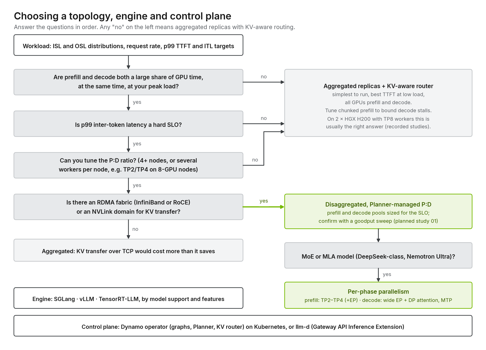

# Inference deployment framework

[Home](../README.md) › Framework

**What it is.** A vendor-neutral decision and delivery process for taking an LLM workload
from requirements to a validated, operated deployment. It is written for partners and
customers choosing between NVIDIA Dynamo, llm-d with Red Hat AI, or another stack. Every
stage has inputs, the decisions taken there, one output artifact and an exit gate. The
[blueprint](../blueprint/README.md) explains *why*, the [tracks](../tracks/README.md)
implement *how*, and each track's studies hold the *evidence*.

## Five stages

| Stage | Question | Inputs | Output artifact | Exit gate |
| --- | --- | --- | --- | --- |
| [1 · Intake](1-intake/README.md) | What must be served, on what, to which SLO? | Model card, hardware inventory, traffic traces, SLOs, constraints | Deployment profile ([template](1-intake/profile.template.yaml)) | Every field filled, or marked `unknown` with a calibration step planned |
| [2 · Decide](2-decide/README.md) | Which serving pattern, model layout, stack and path? | Profile | Design record ([template](2-decide/design-record.template.md)) | Each decision cites a matrix row and, where one exists, a study |
| [3 · Size](3-size/README.md) | How many GPUs, workers and replicas, which P:D ratio, how much KV? | Design record, calibration runs | Sizing sheet | Weights and KV fit per worker; capacity at SLO comes from measured, not quoted, throughput |
| [4 · Deploy and validate](4-validate/README.md) | Does it meet the SLO on the target hardware? | Track path guide, sizing sheet | Study: protocol, data, report | Acceptance criteria met, with recorded evidence |
| [5 · Operate](5-operate/README.md) | Does it keep meeting the SLO? | Dashboards, alerts, change log | Runbook and re-validation triggers | Re-validation after every model, engine, router or traffic change |

Stages loop. A failed gate in stage 4 sends you back to stage 2 with a measured number in
place of an assumption, which is the point of the process.

## Decision dimensions

| Dimension | Values | What it changes | Background |
| --- | --- | --- | --- |
| **Model architecture** | Dense, MoE, MoE + MLA, hybrid SSM / linear attention, multimodal | KV bytes per token, KV transfer intensity, which parallelism fits | [06](../blueprint/06-model-architectures.md), [15 §3](../blueprint/15-workload-driven-design.md#3-model-type-and-size) |
| **Model size and precision** | ≤ 15B to ≥ 600B; BF16, FP8, FP4 | Minimum GPUs per worker, TP/EP degree, room left for KV | [09](../blueprint/09-parallelism-and-sizing.md) |
| **Hardware** | Hopper or Blackwell; 8-GPU HGX or rack-scale NVL72; InfiniBand, RoCE or TCP; block or shared storage | Largest worker, whether P/D or wide EP can pay off, cold-start time | [07](../blueprint/07-hardware-network-storage.md) |
| **Solution stack** | NVIDIA Dynamo; llm-d with Red Hat AI; others | Which patterns are available and supported, platform fit | [04](../blueprint/04-orchestration-layer.md), [tracks](../tracks/README.md) |
| **Workload** | Multi-turn chat, RAG, agent loop, agentic coding, reasoning, code completion, batch | ISL, OSL and prefix reuse, hence the prefill-to-decode work ratio *R* | [15 §4](../blueprint/15-workload-driven-design.md#4-workload-types) |
| **Optimization goal** | Long context, output-optimized, SLA (goodput), throughput and cost | The metric you accept against and the study that proves it | [2 · Decide](2-decide/README.md#optimization-goals) |

## Where things live

| Folder | Role in the process |
| --- | --- |
| [framework/](.) | This process: stages, templates, decision matrices |
| [blueprint/](../blueprint/README.md) | Vendor-neutral knowledge the decisions cite (chapters 01–15) |
| [tracks/nvidia-dynamo/](../tracks/nvidia-dynamo/README.md) | Track 1: Dynamo install, graphs, production overlay, sites, studies |
| [tracks/llm-d-redhat/](../tracks/llm-d-redhat/README.md) | Track 2: llm-d with Red Hat AI Inference Server, one folder per well-lit path, studies |
| [platform/](../platform/README.md) | Cluster layer both tracks share: GPU and Network Operators, RDMA, storage, site values |
| [benchmarks/](../benchmarks/README.md), [tools/](../tools/README.md), [datasets/](../datasets/README.md) | Instruments: load generators, generators and validators, workload datasets |
| [reference/](../reference/README.md) | Glossary, engine flags, pinned sources, troubleshooting, vendored upstream schemas |

## Worked example

A partner needs DeepSeek V4 Pro for multi-turn sessions over 256K-token documents on four
8 × H200 nodes and prefers Red Hat support. The [intake example](1-intake/examples/deepseek-v4-pro-256k-multiturn.yaml)
records that. Stage 2 picks aggregated TP8 replicas with prefix-aware routing on the
llm-d track ([path 01](../tracks/llm-d-redhat/paths/01-optimized-baseline/README.md)), because
the checkpoint (893 GB) needs a full node and the reuse makes routing matter more than P/D.
Stage 3 fixes four replicas, one per node. Stage 4 is the
[256K routing study](../tracks/llm-d-redhat/studies/deepseek-v4-pro-256k-routing/README.md),
which compares cache-unaware against prefix-aware scheduling on the same deployment.
