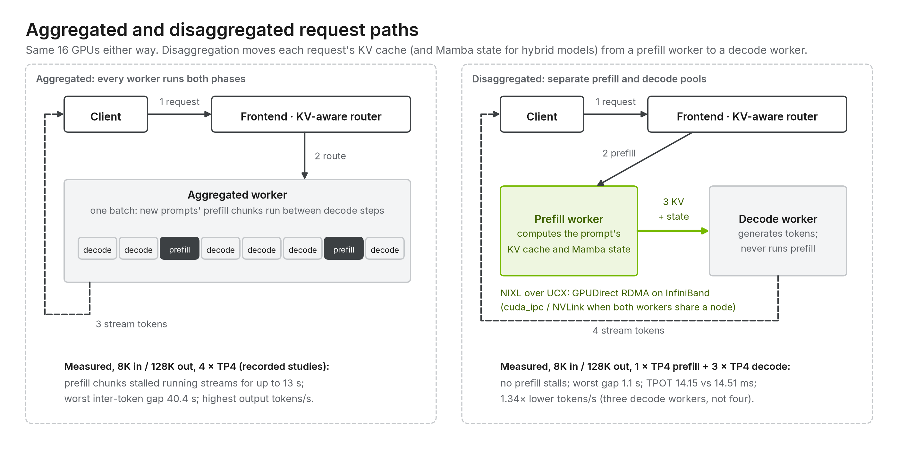

# 03 · Disaggregated serving with Dynamo + SGLang

[Home](../../../../../README.md) › [Tracks](../../../../README.md) › [NVIDIA Dynamo](../../../README.md) › [Sites](../../README.md) › [hgx-b300-2x8](../README.md) › 03 · Dynamo disaggregated · SGLang

**Goal:** the same prefill/decode split as [02](../02-dynamo-disagg-vllm/), with **SGLang** as the engine. Dynamo's frontend, router and discovery are unchanged. Only the workers and their transfer settings differ.

With SGLang, decode first contacts the prefill worker's **bootstrap server on port 8998**, then prefill sends the KV cache through SGLang's NIXL transfer engine.

## Pick your platform

| Platform | Deploy guide | Files |
|---|---|---|
| Docker Compose | [docker/README.md](../compose/03-dynamo-disagg-sglang/README.md) | [node-a.yaml](../compose/03-dynamo-disagg-sglang/node-a.yaml) (etcd, frontend, prefill), [node-b.yaml](../compose/03-dynamo-disagg-sglang/node-b.yaml) (decode) |
| Kubernetes | [kubernetes/README.md](KUBERNETES.md) | `00-namespace` … `30-prefill`, `31-decode` |

The baseline to compare against is [01 · Aggregated · SGLang](../01-aggregated/sglang/).

## How SGLang disaggregation differs from vLLM

| | vLLM ([02](../02-dynamo-disagg-vllm/)) | SGLang (this track) |
|---|---|---|
| Worker module | `python -m dynamo.vllm` | `python -m dynamo.sglang` |
| Role flag | `--disaggregation-mode prefill/decode` | `--disaggregation-mode prefill/decode` |
| Transfer configuration | `--kv-transfer-config` with `NixlConnector` | `--disaggregation-transfer-backend nixl` |
| Transfer handshake | NIXL side channel, port 5600 | **Bootstrap server** on prefill, port **8998** |
| UCX selection | `UCX_*` env | `SGLANG_DISAGGREGATION_NIXL_BACKEND=UCX` + `..._BACKEND_PARAMS` with the HCAs, plus `UCX_*` |
| KV page size | `--block-size 64` | `--page-size 64` |
| KV dtype in this repo | `fp8` | `auto` |
| Internal HTTP port | n/a | 30000 (the public API stays on the frontend's 8000) |

The full flag mapping is in [reference/vllm-vs-sglang.md](../../../../../reference/vllm-vs-sglang.md). Equal numbers do not mean equal behavior: the two schedulers interpret memory and batch limits differently.

## Status and model choice

- **Experimental.** NVIDIA's Nemotron 3 Ultra SGLang cookbook covers **aggregated** serving only. NIXL transfer of this hybrid model's Mamba state in SGLang has not been qualified, and nothing on this track has run on the reference hosts. Start with the aggregated SGLang baseline, then this track at concurrency 1.
- **If prefill/decode transfer fails with Nemotron**, switch the track to a standard transformer such as `Qwen/Qwen3-Coder-480B-A35B-Instruct-FP8`, which SGLang's P/D path supports widely. The changes are listed in [reference/models.md](../../../../../reference/models.md#switching-a-reference-deployment-to-another-model). Use the same model on the aggregated baseline.
- The SGLang image is referenced by tag. Pin it by digest after your first pull ([production operations](../../../../../blueprint/10-production-operations.md)).

## What to observe

The same checks as [02 · What to observe](../02-dynamo-disagg-vllm/#what-to-observe). In addition, the decode logs should show a successful connection to the prefill bootstrap server on Node A port 8998. If decode cannot reach 8998, requests hang after prefill.

---

**Next:** [04 · llm-d](../../../../llm-d-redhat/paths/05-pd-disaggregation/hgx-b300-qwen3-coder-480b/) · [benchmarks](../../../../../benchmarks/README.md)
